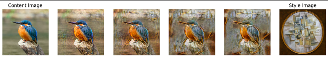

# Image style transfering

## Main goal
Developing style transfering application working with an arbitrary pair of images: content and style.

## Intro
An artificial system based on a Deep Neural Network was introduced by Leon A. Gatys, Alexander S. Ecker, Matthias Bethge: it creates artistic images of high perceptual quality. The system uses neural representations to separate and recombine content and style of arbitrary images, providing a neural algorithm for the creation of artistic images.

Original paper: https://arxiv.org/abs/1508.06576

## Back-end
Back-end part of the project based on Magenta Fast Style Transfer for Arbitrary Styles -  open-sources machine learning system for performing fast artistic style transfer that may work on arbitrary painting styles. In addition, because this system provides a learned representation, one may arbitrarily combine painting styles as well as dial in the strength of a painting style, termed "identity interpolation"

https://github.com/magenta/magenta/blob/main/README.md

#### Difficulties
Main problems encountered during development are related to Magenta - this repository has been inactive for a while, so it requiered some efforts to get the scripts working. Here is an example of style transferring with different grades of "identity interpolation":  

Despite of the fact that Magenta gives tools to train your model for style transferring, it takes to much time to get the model trained to at least acceptable quality level. So pretrained model was used at back-end for deployment.

## Front-end
This part of the project was developed on Django.
Web application implementing NN arbitrary style transfer model is available on the following link: <a href='https://demopyt-production.up.railway.app/style_transfer/' target="_blank"> link to app</a>

## Summary

Developed arbitrary style transfering web application consist of:

1) Magenta based back-end
2) Django based front-end

The application can be tested on the following link:
<a href='https://demopyt-production.up.railway.app/style_transfer/' target="_blank"> link to app</a>

### Important terms

***TFRecords***

TFRecord is a custom TensorFlow format for storing a sequence of binary records. TFRecords are highly optimized for TensorFlow, which lead to them having the following advantages:
* Efficient form of data storage
* Faster read speed compared to other types of formats

  
## Libraries & tools used
* see the requirements
